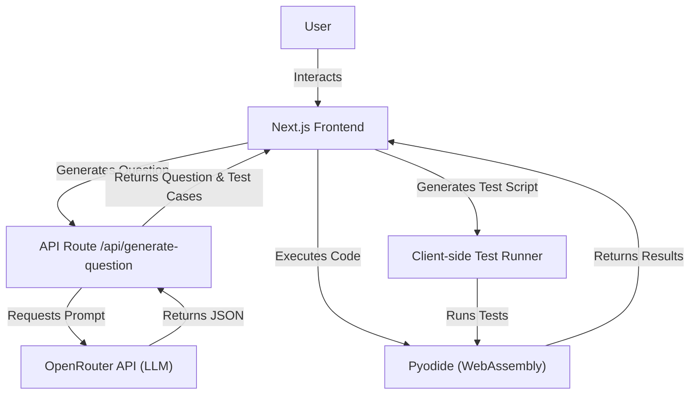

# EvalaCode Project Guide

## Commands

- **Dev Server**: `pnpm dev`
- **Build**: `pnpm build`
- **Start**: `pnpm start`
- **Lint**: `pnpm lint`

## Architecture

## Tech Stack

- **Framework**: Next.js 14 (App Router)
- **Language**: TypeScript
- **Styling**: Tailwind CSS
- **Editor**: Monaco Editor (`@monaco-editor/react`)
- **Runtime**: Pyodide (WebAssembly Python)
- **AI**: OpenRouter API

## Git Workflow

- **No Direct Pushes**: Do NOT push directly to `main` branch.
- **Feature Branches**: Always use feature branches for changes.
- **Pull Requests**: Create PRs to merge changes into `main`.
- **Commits**: Make standard git commits. NEVER use agent credentials or committer identities.

## Coding Standards

### TypeScript

- Use `interface` for object definitions.
- Avoid `any` types; use specific types or generics.
- Strict mode is enabled.

### React / Next.js

- Use functional components with hooks.
- Use `src/app` directory structure.
- Server Components by default; use `'use client'` when needing interactivity or hooks.
- Component names: PascalCase (e.g., `CodeEditor.tsx`).
- Helper functions: camelCase (e.g., `generateTestRunnerScript`).

### Styling

- Use Tailwind CSS utility classes.
- Avoid custom CSS files unless necessary for complex animations or overrides.
- Use `lucide-react` for icons.

### State Management

- Use React `useState` and `useEffect` for local state.
- For complex global state, consider context or external libraries (currently standard React state is sufficient).

### Testing

- **Manual verification** is currently primary.
- Test runner logic is client-side in `src/app/page.tsx`.
