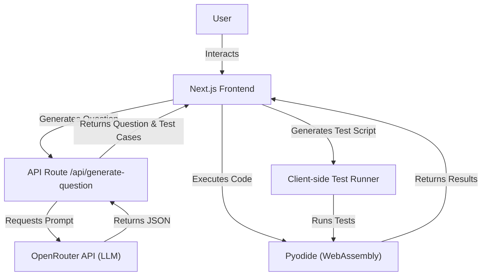

# EvalaCode

EvalaCode is an interactive Python coding environment that runs entirely in your browser using Pyodide. It features a built-in Leetcode-style problem generator and a seamless coding console with instant execution—no setup required.

---

## 🏗️ Architecture



## ✨ Features

- 🧩 **Problem Generator**  
  Get auto-generated Leetcode-style problems tailored by difficulty (`Easy`, `Medium`, `Hard`), complete with function signatures and test cases. Now powered by a robust client-side test runner.

- 🧠 **Built-in Python Execution**  
  Runs Python in-browser using [Pyodide](https://pyodide.org) — no server execution or backend runtimes needed.

- 🖥️ **Monaco Editor Integration**  
  A clean, VS Code-like editing experience right in the browser.

- 💾 **Dynamic Packages**  
  Install and use Python packages via `micropip` on the fly.

- 🧪 **Reliable Testing**
  Client-side verification ensures tests are syntactically valid and resistant to AI hallucinations.

---

## 🚀 Getting Started

### Prerequisites

- Node.js 18+
- pnpm
- Valid `OPENROUTER_API_KEY` in `.env`

### Installation

1.  Clone the repository:

    ```bash
    git clone https://github.com/kalebtsegay/evalacode.git
    cd evalacode
    ```

2.  Install dependencies:

    ```bash
    pnpm install
    ```

3.  Set up environment variables:

    ```bash
    cp .env.example .env
    # Add your OPENROUTER_API_KEY
    ```

4.  Run the development server:
    ```bash
    pnpm dev
    ```

---

## 📦 Tech Stack

- **Frontend**: [Next.js](https://nextjs.org), [TailwindCSS](https://tailwindcss.com), [TypeScript](https://www.typescriptlang.org)
- **Editor**: [Monaco Editor](https://github.com/microsoft/monaco-editor)
- **Runtime**: [Pyodide](https://pyodide.org) (Python in WASM)
- **AI**: OpenRouter API for question generation
